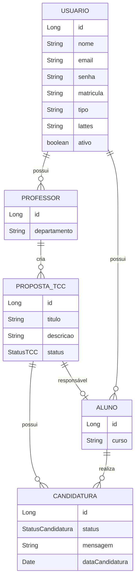
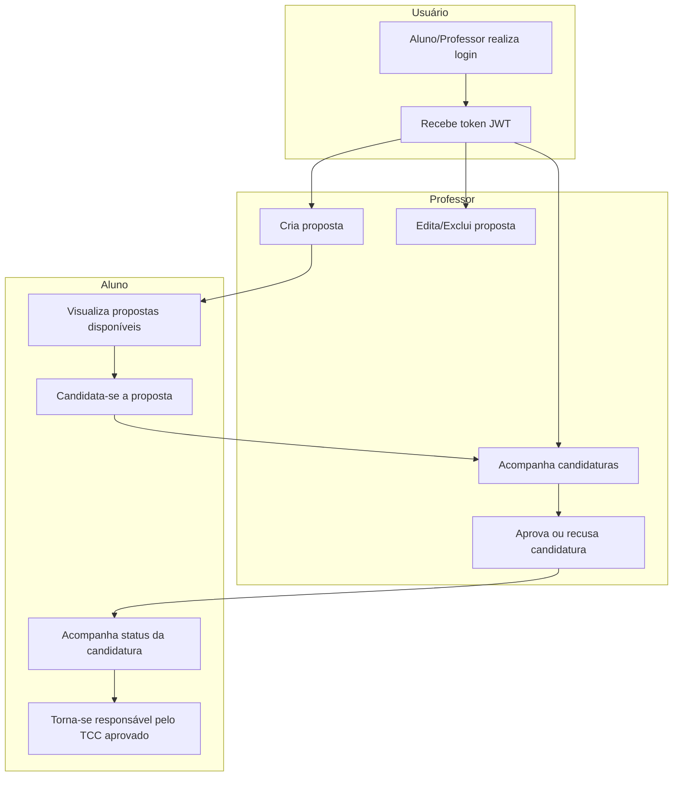

# ConectaTCC


ConectaTCC é uma plataforma acadêmica desenvolvida para o IFRS, com o objetivo de gerenciar propostas de Trabalho de Conclusão de Curso (TCC) e facilitar a comunicação entre alunos e professores.

---

## 📚 Sumário

- [Descrição](#descrição)
- [Tecnologias](#tecnologias)
- [Como Executar](#como-executar)
- [Endpoints Principais](#endpoints-principais)
- [Diagrama de Entidades](#diagrama-de-entidades)
- [Diagrama de Fluxo](#diagrama-de-fluxo)
- [Contribuição](#contribuição)
- [Licença](#licença)
- [Autores](#autores)
- [Contato](#contato)

---

## 📝 Descrição

O sistema permite que professores cadastrem propostas de TCC, alunos se candidatem a essas propostas e ambos acompanhem o andamento das candidaturas e aprovações. A segurança é garantida por autenticação JWT, separando permissões entre alunos e professores.

Principais funcionalidades:

- Cadastro e autenticação de usuários (aluno/professor)
- Cadastro, edição e exclusão de propostas de TCC (professor)
- Candidatura de alunos às propostas disponíveis
- Aprovação, recusa e acompanhamento de candidaturas
- Controle de status dos TCCs (Disponível, Em Andamento, Aprovado, etc.)

---

## 🛠️ Tecnologias

- **Java 17+**
- **Spring Boot**
- **Spring Security** (autenticação JWT)
- **JPA/Hibernate** (persistência)
- **H2 Database** (para testes locais)
- **Swagger/OpenAPI** (documentação da API)
- **Lombok** (facilita construção de modelos)
- **Mermaid** (diagramas no README)
- **JUnit** (testes)

---

## ▶️ Como Executar

### Pré-requisitos

- Java 17 ou superior instalado
- Maven 3.8+ instalado
- (Opcional) IDE como IntelliJ, Eclipse ou VSCode

### Passos para rodar localmente

1. **Clone o repositório**
    ```bash
    git clone https://github.com/ericfr1tzenvalle/ConectaTCC.git
    cd ConectaTCC
    ```

2. **Configure o arquivo de propriedades**
    - Edite `src/main/resources/application.properties` se necessário:
        - Porta padrão: `server.port=8080`
        - Banco H2: já configurado para uso local
        - Chave JWT: adicione uma linha como `jwt.secret=UmaChaveSuperSecretaAqui123`

3. **Instale dependências e execute**
    - Pelo terminal:
        ```bash
        ./mvnw spring-boot:run
        ```
    - Ou rode pelo botão “Run” da sua IDE.

4. **Acesse os serviços**
    - API: [http://localhost:8080](http://localhost:8080)
    - Swagger: [http://localhost:8080/swagger-ui.html](http://localhost:8080/swagger-ui.html)
    - Console H2: [http://localhost:8080/h2-console](http://localhost:8080/h2-console)
        - JDBC URL padrão: `jdbc:h2:mem:testdb`
        - Usuário: `sa`
        - Senha: (em branco)

### Primeiros Passos

- Cadastre um professor ou aluno em `/auth/register/aluno` ou `/auth/register/professor`
- Realize login em `/auth/login` e salve o token JWT retornado
- Use esse token nos endpoints protegidos, adicionando o cabeçalho:
    ```
    Authorization: Bearer SEU_TOKEN_JWT_AQUI
    ```

### Testes

- Para rodar os testes:
    ```bash
    ./mvnw test
    ```

---

## 🔗 Endpoints Principais

- `POST /auth/register/aluno` - Cadastro de aluno
- `POST /auth/register/professor` - Cadastro de professor
- `POST /auth/login` - Login (retorna JWT)
- `GET /propostas/todas` - Listar todas propostas
- `POST /propostas/criar` - Criar proposta (professor)
- `PUT /propostas/atualizar/{id}` - Atualizar proposta
- `DELETE /propostas/deletar/{id}` - Deletar proposta
- `POST /candidaturas/criar` - Aluno se candidata
- `PUT /candidaturas/aceitar/{id}` - Professor aceita candidatura

> ⚠️ **A documentação interativa da API (Swagger) ainda não está implementada. O endpoint `/swagger-ui.html` estará disponível em futuras versões.**

---

## 📈 Diagrama de Entidades



---

## 🔄 Diagrama de Fluxo do Sistema



---

## 🤝 Contribuição

Contribuições são bem-vindas!  
Para contribuir, faça um fork, crie uma branch, envie um PR e descreva suas alterações.  
Sugestões de melhorias, novas funcionalidades e correções são sempre apreciadas.

---

## 📄 Licença

Este projeto está licenciado sob a [MIT License](LICENSE).

---

## 👥 Autores

- **Éric Fritzen Valle**  
  Email: 2024020020@aluno.osorio.ifrs.edu.br

- **Benício Reinehr Dal Forno**  
  Email: 2024019988@aluno.osorio.ifrs.edu.br

---

## 📬 Contato

Para dúvidas, sugestões ou informações:
- Email: conectatcc.dev@outlook.com.br
- Email: conectatcc.dev@gmail.com

---
